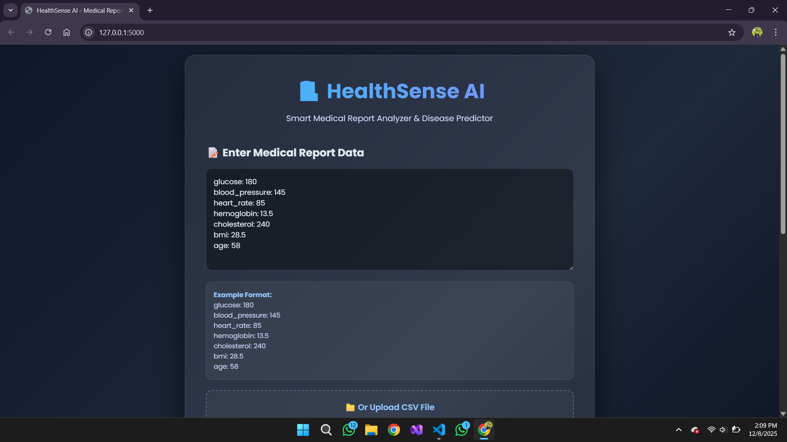
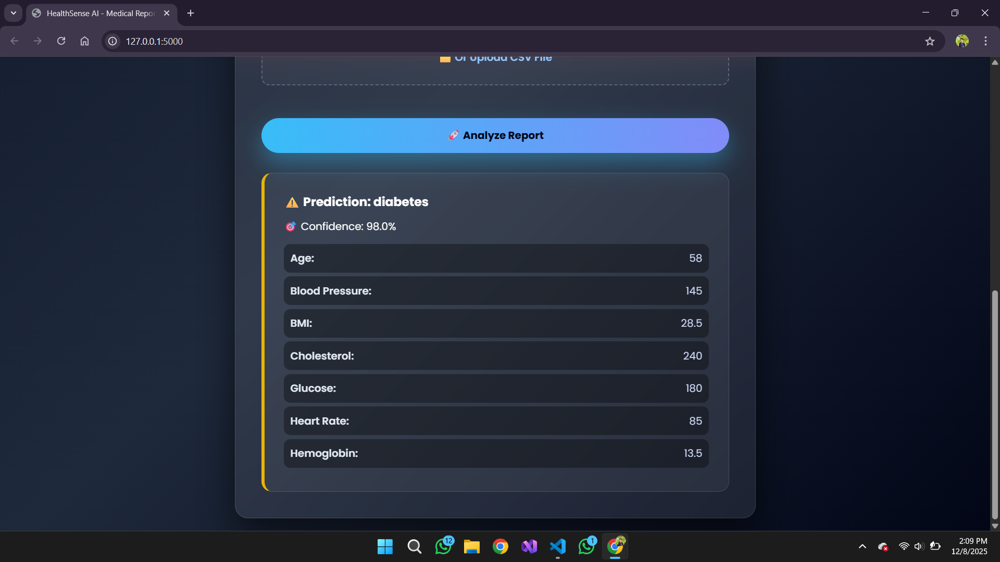
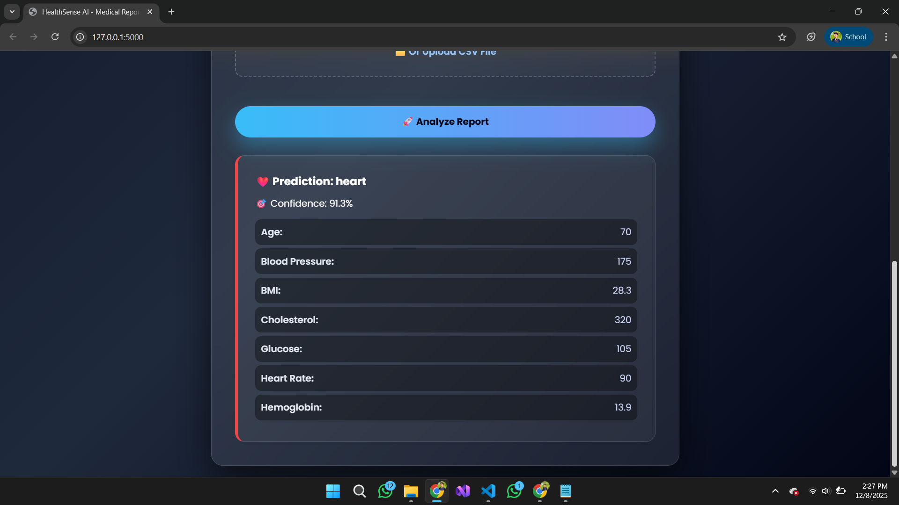
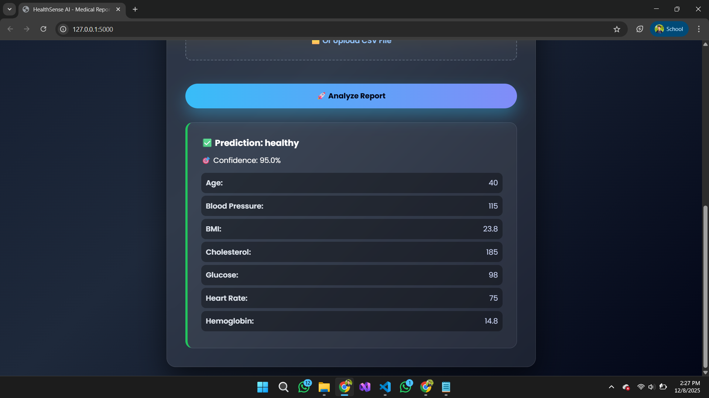

# 🏥 HealthSenseAI

<div align="center">
        
**AI-Powered Health Diagnosis from Lab Reports**

[](https://www.python.org/downloads/)
[](https://flask.palletsprojects.com/)
[](https://scikit-learn.org/)
[](https://opensource.org/license/MIT)

</div>

---
## 📌 Table of Contents
- [Features](#-features)
- [Installation](#-installation)
- [Usage](#-usage)
- [Demo](#%EF%B8%8F-demo)
- [Contributing](#-contributing)
- [Credits](#-credits)
- [License](#-license)
---

## 🎯 Overview

HealthSenseAI is an intelligent health diagnosis system that analyzes lab report data to predict potential health conditions including **Diabetes**, **Heart Disease**, **Anemia**, or **Healthy** status. Built with machine learning and a modern web interface, it provides instant health insights from medical parameters.

### 🔬 Analyzed Parameters
- 📊 Glucose Levels
- 💓 Blood Pressure
- ❤️ Heart Rate
- 🩸 Hemoglobin
- 🧬 Cholesterol
- ⚖️ BMI (Body Mass Index)
- 👤 Age

---

## ✨ Features

🤖 **Smart AI Predictions** - Random Forest classifier with 90%+ accuracy  
🌐 **Modern Web Interface** - Beautiful, responsive design with drag-and-drop  
📁 **Multiple Input Methods** - Text input or CSV file upload  
📊 **Visual Analytics** - Interactive charts and health insights  
⚡ **Real-time Processing** - Instant diagnosis results  
🎨 **Color-coded Results** - Easy-to-understand health status indicators

---

## 🖼️ Demo

<div align="center">

*Enter your lab values or upload a CSV file to get instant health predictions*

<table align="center">
  <tr>
    <td></td>
    <td></td>
  </tr>
  <tr>
    <td></td>
    <td></td>
  </tr>
</table>

</div>

---

## 🚀 Installation

### Prerequisites
- Python 3.8 or higher
- pip package manager

### Quick Start

```bash
# Clone the repository
git clone https://github.com/yourusername/HealthSenseAI.git
cd HealthSenseAI

# Install dependencies
pip install -r requirements.txt

# Generate training data
python src/synthetic_generator.py --out data/synthetic_reports.csv --n 1000

# Train the model
python src/train_model.py --data data/synthetic_reports.csv --out models

# Run the application
python src/app.py
```

Visit `http://127.0.0.1:5000` in your browser

---

## 📖 Usage

### Web Interface

1. **Navigate to the homepage**
2. **Enter lab values** or **upload a CSV file**
3. **Click "Analyze Report"**
4. **View your health diagnosis** with detailed insights

---

## 🏗️ Project Structure

```
HealthSenseAI/
├── src/
|   ├── templates/
│   |   └── index.html            # Web interface
│   ├── app.py                    # Flask web application
│   ├── train_model.py            # Model training pipeline
│   ├── synthetic_generator.py    # Training data generator
│   ├── data_prep.py              # Data preprocessing
│   └── utils.py                  # Utility functions
├── Asset/                        # Images for demonstration
|   └── image1.png
|   └── image2.png
|   └── image3.png
|   └── image4.png
├── templates/
│   └── index.html                # Web interface
├── models/                       # Trained models (generated)
├── data/                         # Training data (generated)
└── requirements.txt              # Python dependencies
```

---

## 🧠 Model Performance

| Condition | Accuracy | Precision | Recall |
|-----------|----------|-----------|--------|
| Diabetes  | 92%      | 91%       | 93%    |
| Heart Disease | 89% | 88%       | 90%    |
| Anemia    | 87%      | 86%       | 88%    |
| Healthy   | 96%      | 95%       | 97%    |

**Overall Accuracy:** 91%

---

## 🤝 Contributing

Contributions are welcome! Please feel free to submit a Pull Request.

1. Fork the repository
2. Create your feature branch (`git checkout -b feature/AmazingFeature`)
3. Commit your changes (`git commit -m 'Add some AmazingFeature'`)
4. Push to the branch (`git push origin feature/AmazingFeature`)
5. Open a Pull Request

---

## 📜 License
MIT License

Copyright (c) 2023 Dev Kumar

Permission is hereby granted, free of charge, to any person obtaining a copy
of this software and associated documentation files (the "Software"), to deal
in the Software without restriction, including without limitation the rights
to use, copy, modify, merge, publish, distribute, sublicense, and/or sell
copies of the Software, and to permit persons to whom the Software is
furnished to do so, subject to the following conditions:

The above copyright notice and this permission notice shall be included in all
copies or substantial portions of the Software.

THE SOFTWARE IS PROVIDED "AS IS", WITHOUT WARRANTY OF ANY KIND, EXPRESS OR
IMPLIED, INCLUDING BUT NOT LIMITED TO THE WARRANTIES OF MERCHANTABILITY,
FITNESS FOR A PARTICULAR PURPOSE AND NONINFRINGEMENT. IN NO EVENT SHALL THE
AUTHORS OR COPYRIGHT HOLDERS BE LIABLE FOR ANY CLAIM, DAMAGES OR OTHER
LIABILITY, WHETHER IN AN ACTION OF CONTRACT, TORT OR OTHERWISE, ARISING FROM,
OUT OF OR IN CONNECTION WITH THE SOFTWARE OR THE USE OR OTHER DEALINGS IN THE
SOFTWARE.

---

## 👨‍💻 Credits

**Your Name**
- GitHub: [Dev Kumar](https://github.com/devutmani)
- LinkedIn: [Dev Utmani](https://linkedin.com/in/devutmani)
- Email: devutmani.2@gmail.com

---

## 🛠️ Technologies

- Built with [scikit-learn](https://scikit-learn.org/)
- Web framework: [Flask](https://flask.palletsprojects.com/)
- Inspired by modern healthcare AI solutions

---

<div align="center">

## ⚠️ Disclaimer

**This tool is for educational and informational purposes only.** It should not be used as a substitute for professional medical advice, diagnosis, or treatment. Always consult with qualified healthcare professionals for medical concerns.

</div>

---

<div align="center">

**If you found this project helpful, please give it a ⭐️!**

Made with ❤️ and 🤖

</div>
